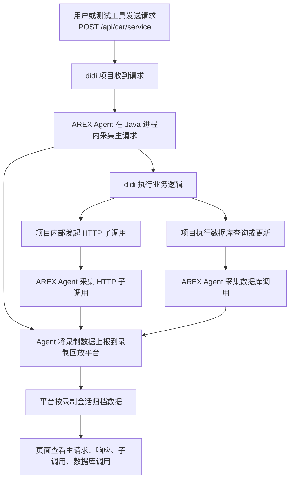

# 录制回放平台与项目关联说明

## 1. 文档目的

本文档用大白话说明三件事：

- 录制回放平台为什么能录到项目请求
- 平台和项目是怎么关联起来的
- 实际项目要满足什么条件，才能录到请求、子调用和数据库调用

本文以当前示例工程 `didi-system-a / didi-system-b` 为例说明。

## 2. 一句话结论

录制回放平台之所以能录到 `didi` 项目的主请求、HTTP 子调用和数据库调用，不是因为平台直接“盯着”项目，而是因为项目启动时挂载了一个 Java Agent。

这个 Agent 像一支“录音笔”：

- 看见主请求进来，就记录主请求和响应
- 看见项目内部发出的 HTTP 请求，就记录子调用
- 看见项目执行数据库查询和更新，就记录数据库调用
- 然后把这些录制数据发回录制回放平台

## 3. 当前示例里的关系

当前环境里有两类系统：

- 录制回放平台：`arex-recorder`
- 被测系统：`didi-system-a`、`didi-system-b`

它们的关系是：

- `didi` 负责真实处理业务请求
- `arex-recorder` 负责接收录制数据、管理录制会话、查看录制结果、执行回放比对
- `arex-agent.jar` 负责在 `didi` 运行过程中采集链路数据

## 4. 流程图

## 5. 平台是怎么录到请求的

### 5.1 主请求

例如你调用：

- `POST /api/car/service`

请求先进入 `didi` 项目。  
`arex-agent.jar` 已经随着 `didi` 一起启动，所以它能在 Java 进程内部看到这次请求，并记录：

- 请求地址
- 请求头
- 请求体
- 响应状态
- 响应体

### 5.2 子调用

复杂交易在处理过程中，会继续发起内部 HTTP 请求，例如：

- `GET /internal/didi/risk`
- `GET /internal/didi/pricing`

这些请求虽然是 `didi` 自己调自己，但本质上仍然是一次真实的 HTTP 调用，所以 Agent 也能采集到。

### 5.3 数据库调用

复杂交易还会访问 MySQL，例如：

- 查询车辆信息
- 查询客户信息
- 写入审计表
- 更新车辆状态

这些数据库操作通过 JDBC 执行，Agent 可以在运行时看到这些数据库调用，因此也能录制下来。

## 6. 平台和项目是怎么关联起来的

平台和项目要真正关联起来，核心有三件事：

### 6.1 项目启动时必须挂载 Agent

项目启动命令里需要有 `-javaagent:/路径/arex-agent.jar`。

这一步相当于把“录音笔”装进项目进程里。  
没有这一步，平台就录不到任何请求。

### 6.2 Agent 必须知道数据发到哪里

项目启动时还要告诉 Agent：

- 录制平台地址
- 录制平台端口

这样 Agent 才知道把录制数据发回哪个平台。

### 6.3 平台和项目要有同一个应用标识

例如当前示例里：

- `didi-system-a` 对应 `didi-car-sat`
- `didi-system-b` 对应 `didi-car-uat`

平台中创建应用时，也要填写相同的标识。  
这样平台才能把收到的录制数据归到正确的项目名下。

## 7. 在当前 didi 示例里，具体是怎么工作的

当前示例中：

- `didi-system-a` / `didi-system-b` 是真实运行的 Spring Boot 服务
- 启动脚本里已经挂了 `arex-agent.jar`
- Agent 会把录制数据发给 `arex-recorder` 后端
- 平台页面里“开始录制”后，平台会记录一个时间窗口
- “停止录制”时，平台会把这个时间窗口里的数据同步成一批录制结果

所以你在平台上最终能看到：

- 主请求
- 主响应
- HTTP 子调用
- 数据库调用

## 8. 实际项目怎么接入

如果换成真实业务项目，通常需要满足以下条件：

### 8.1 项目是 Java 服务

最适合的是：

- Spring Boot
- JDK 8 / 11 / 17
- 使用 JDBC、MyBatis、JPA 等常见数据库访问方式
- 使用常见 HTTP 客户端访问下游系统

### 8.2 能修改启动方式

实际项目必须能改启动命令、启动脚本或容器启动参数，以便加上：

- `-javaagent`
- Agent 目标平台地址
- 服务标识

### 8.3 项目所在机器能访问录制平台

也就是：

- 网络要通
- 端口要通
- 防火墙不能拦截

### 8.4 平台里要先创建应用

平台中要配置：

- 应用名称
- 服务地址
- 应用标识
- 对应启动方式

这样平台才能管理这套服务的录制和回放。

## 9. 接入实际项目的标准步骤

建议按以下顺序实施：

1. 部署录制回放平台并确认平台可用
2. 准备 `arex-agent.jar`
3. 修改项目启动命令，挂载 Agent
4. 配置 Agent 上报地址和应用标识
5. 启动项目并确认 Agent 初始化成功
6. 在平台中创建应用
7. 在平台中开始录制
8. 发送真实业务请求
9. 停止录制并同步结果
10. 在平台页面查看主请求、子调用和数据库调用

## 10. 常见失败原因

实际接入时，最常见的问题有这些：

- 没挂 `-javaagent`
- 平台地址配置错误
- 平台没先启动
- 应用标识不一致
- 网络或端口不通
- 项目虽然收到请求，但 Agent 没把数据上报成功

## 11. 管理价值

这套方案的价值不是“打印日志”，而是把一次真实交易完整沉淀下来，用于后续回放和回归验证。

管理层可直接理解为：

- 把真实业务请求变成可重复执行的测试资产
- 自动记录一次交易的入口请求、子调用和数据库行为
- 后续版本发布时，能重复回放同样的数据，检查是否出现回归问题

## 12. 总结

录制回放平台和业务项目的关联，本质上是：

- 在业务项目里挂载 Agent
- 让 Agent 把录制数据发回平台
- 用统一的应用标识把平台和项目对应起来

一旦接入成功，平台就能把“主请求 + 子调用 + 数据库调用”作为一条完整交易链路管理起来，后续即可用于录制沉淀、回放验证和问题排查。
